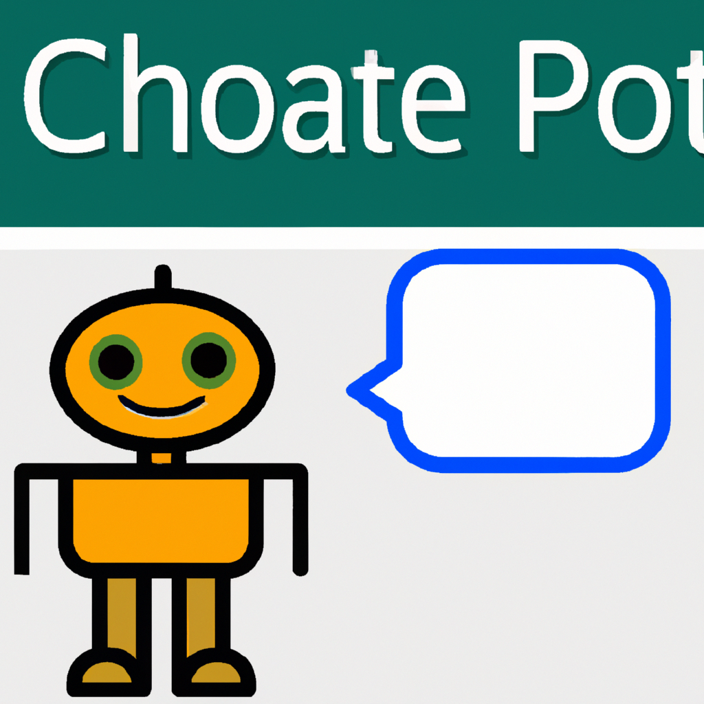
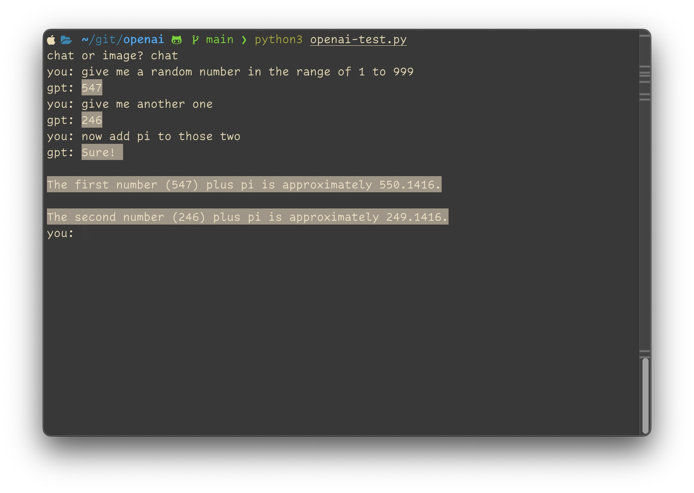

# ChatGPT and DALL-E CLI

This Python program uses two different AI models - GPT and Dalle API - to generate text and images respectively. GPT is a text-generating AI model and Dalle is an image-generating AI model. The program can be used to generate text and images based on user input.

## Requirements

To run this program, you will need the following:

- Python 3.7 or higher
- OpenAI API Key for GPT and DALL-E(Available at https://beta.openai.com/signup/)

## Installation

To get started with this program, follow the steps below:

1. Clone the repository to your local machine.
2. Run `pip install openai`
3. Add your API key as an envirement variable `OPENAI_API_KEY`

## Usage

To use this program, follow the steps below:

1. Open a terminal window and navigate to the directory where you have cloned the repository.
2. Run the command `python openai-test.py`.
3. Follow the prompts to provide input for GPT and Dalle models to generate text and image respectively.

## Credits

This program was created by Tieu Long Ho as part of an fun midnight test project.

It uses OpenAI's GPT API and Dalle API.

## License

This program is licensed under the [MIT License](https://opensource.org/licenses/MIT)
